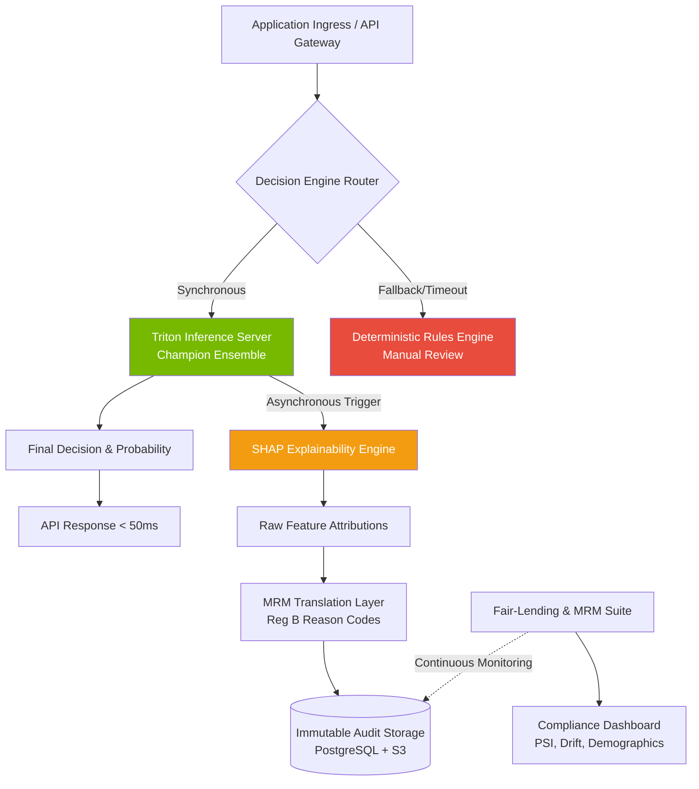

```markdown
# AI Underwriting Engine

**Enterprise-grade credit decisioning architecture designed for rigorous predictive accuracy, structural explainability, and strict alignment with regulatory risk management frameworks.**

[](https://www.python.org/)
[](https://xgboost.ai/)
[](https://developer.nvidia.com/triton-inference-server)
[](#)

---

## 🎯 Primary Objectives

Modernize credit underwriting infrastructure through a machine learning ensemble framework, constrained by rigorous compliance and operational stability guardrails:
- **Predictive Lift:** Improve default classification metrics (KS, AUC) relative to legacy systems, utilizing robust reject-inference methodologies.
- **Regulatory Adherence:** Provide foundational data and telemetry to support ECOA (Reg B), HMDA reporting, and Less Discriminatory Alternatives (LDA) analysis.
- **Explainability:** Map complex ensemble outputs to consumer-understandable, stable principal reasons for adverse actions.
- **Operational Resilience:** Ensure high-availability serving with automated champion/challenger routing and deterministic fallback mechanisms.

---

## 🏗️ Architecture & Execution Flow

To meet strict latency SLAs while satisfying regulatory explainability requirements, the system decouples synchronous inference from asynchronous compliance logging.



---

## 🗺️ Implementation Phases

The rollout of the AI Underwriting Engine is structured to ensure regulatory alignment and technical stability at every gate.

1. **Phase 1: Foundation & Data Engineering**
* Complete historical data ingestion and apply reject-inference algorithms to address selection bias.
* Execute automated proxy variable detection to scrub impermissible data points.
* Establish baseline metrics against the legacy rules engine.


2. **Phase 2: Model Development & Tuning**
* Train and optimize the XGBoost and LightGBM ensemble candidate models.
* Develop the asynchronous SHAP computation pipeline.
* Map raw SHAP feature attributions to consumer-friendly Reg B adverse action reason codes.


3. **Phase 3: MRM Validation & Compliance Testing**
* **Gate:** Independent SR 11-7 conceptual soundness review.
* Execute fair-lending regression suite (disparate impact, demographic parity, equalized odds).
* Complete Less Discriminatory Alternatives (LDA) analysis and document business-necessity justifications.


4. **Phase 4: Shadow Deployment & Infrastructure Setup**
* Deploy the NVIDIA Triton Inference Server in a production-mirror environment.
* Route live application data to the new ensemble in "shadow mode" (decisions logged, not executed).
* Validate sub-50ms latency SLAs and system autoscaling under peak load.


5. **Phase 5: Production Cutover & Monitoring**
* Gradual traffic split (e.g., 5% -> 25% -> 100%) to the champion model.
* Activate automated drift alerting (Population Stability Index thresholds).
* Integrate fully with HMDA/ECOA automated reporting pipelines.


---

## 🛡️ Model Risk Management (MRM) & Compliance

Aligned with Federal Reserve SR 11-7 and OCC Bulletin 2011-12 standards.

### Credit Modeling Fundamentals

* **Reject Inference:** Models are trained using iterative reclassification and fuzzy augmentation to account for selection bias in historical, approved-only datasets.
* **Proxy Detection:** Automated correlation scanning against protected class data to scrub impermissible proxy variables prior to feature selection.
* **Performance Metrics:** Continuous tracking of Kolmogorov-Smirnov (KS) statistics, Gini coefficients, Population Stability Index (PSI), and calibration curves.

### Fair Lending Controls

* **Less Discriminatory Alternatives (LDA):** Automated pipeline to train and evaluate alternative model specifications, ensuring the chosen model minimizes disparate impact while maintaining business necessity.
* **Adverse Action Compliance:** Adherence to CFPB Circulars 2022-03 and 2023-03. SHAP outputs are strictly governed by a compliance-approved mapping logic to ensure applicants receive accurate, specific reasons for denial without algorithm-induced obfuscation.
* **Disparate Impact Testing:** Routine calculation of Marginal Effect (ME) and Standardized Mean Difference (SMD) across protected classes.

---

## 🛠️ Technology Stack

* **Language & Runtimes**: Python 3.12, ONNX, TensorRT
* **Algorithm Frameworks**: XGBoost, LightGBM, scikit-learn
* **Interpretability**: SHAP (TreeExplainer)
* **Serving Layer**: NVIDIA Triton Inference Server, FastAPI (Translation/Routing Layer)
* **Data Processing**: Polars, Pandas
* **Orchestration & Tracking**: MLflow (Artifacts), Airflow/Dagster (Pipelines)
* **Observability**: Prometheus, Grafana (Latency, Hardware, PSI/Drift metrics)
* **Infrastructure**: Kubernetes, S3-compatible immutable storage, PostgreSQL

---

## 🚀 Quick Start & Development

### 1. Environment Setup

```bash
git clone [https://github.com/internal-org/ai-underwriting-engine.git](https://github.com/internal-org/ai-underwriting-engine.git)
cd ai-underwriting-engine

conda create -n underwriting python=3.12
conda activate underwriting

pip install -r requirements.txt
pip install -r requirements-dev.txt

```

### 2. Configuration & Training

Copy the example environment configuration and edit paths for your local data stores:

```bash
cp .env.example .env

```

Execute the training pipeline (includes automated cross-validation and reject-inference handling):

```bash
python -m src.training.pipeline \
  --data-path data/historical_lending.parquet \
  --ensemble xgboost-lightgbm \
  --output models/artifacts/

```

### 3. Local Triton Inference Server

```bash
docker run --gpus=1 --rm -p8000:8000 -p8001:8001 -p8002:8002 \
  -v ${PWD}/triton_model_repo:/models \
  nvcr.io/nvidia/tritonserver:24.01-py3 \
  tritonserver --model-repository=/models

```

---

## 📁 Project Structure

```text
ai-underwriting-engine/
├── src/
│   ├── training/          # Pipeline, reject inference, & ensemble logic
│   ├── inference/         # Triton backend routing & fallback logic
│   ├── explainability/    # Async SHAP computation & Reg B translation
│   ├── compliance/        # Fair lending (LDA, proxy detection) reporting
│   └── dashboard/         # MRM drift & stability UI (FastAPI)
├── models/                # Versioned MLflow artifacts
├── triton_model_repo/     # Triton deployment configurations
├── configs/               # YAML system parameters
├── tests/                 # Unit, integration, and compliance validation
├── docs/                  # SR 11-7 artifacts, APIs, mapping schemas
├── requirements.txt
└── Dockerfile

```

---

## 📈 Deployment & Validation Protocols

**Pre-Production Gates:**

* Independent MRM validation sign-off required for all major model iterations.
* Complete fair-lending regression suite execution.
* Macroeconomic stress testing (through-the-cycle validation).

**Production Operations:**

* **Latency SLA**: p99 ≤ 50 ms (Inference only); Async explainability logging ≤ 2000 ms.
* **Availability**: 99.99% uptime with automated rules-engine failover.
* **Alerting**: Automated triggers for PSI threshold breaches or sub-population bias drift.
* **Audit Retention:** 7 years (immutable logs).

---

## 📜 License & Governance

**Proprietary & Confidential** — © 2026 Internal use only.

Unauthorized distribution prohibited. All modifications require approval from the Model Risk Management and Fair Lending compliance committees.

```
